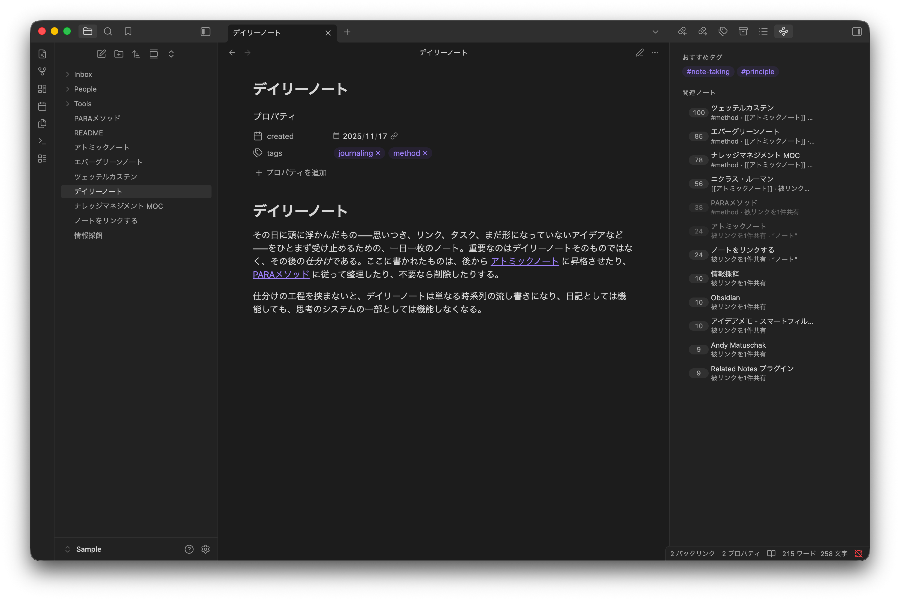

# Suggested Notes

An [Obsidian](https://obsidian.md) sidebar plugin that shows notes related to the active note. Japanese and English are analyzed together, including mixed-language study and technical notes.

Related notes are picked by a weighted score over shared tags, links, backlinks, and content words from titles and bodies. Everything runs locally: no AI, no network, and no always-on background process.

[日本語 README](./README.ja.md)

## Highlights

- **Bilingual morphology** — Kuromoji/IPADIC and wink-nlp extract content words and normalize inflections in mixed Japanese/English text ([details](#japanese-and-english-morphology))
- **Content-aware by default** — title words and salient body words form one deduplicated content signal. Disable body matching to avoid a vault-wide body index
- **Offline, no AI** — no embeddings, no external APIs
- **No full-vault scan per query** — inverted indexes narrow candidates before scoring. Mobile is [being verified for the v0.6.2 prerelease](docs/mobile-testing.md)
- **Never writes plugin state to your notes** — notes change only when you explicitly add a suggested tag
- **UI in Japanese and English** — follows Obsidian's language setting

## Japanese and English morphology

Text is routed by span rather than classifying an entire note as one language.
Kuromoji/IPADIC handles Japanese; wink-nlp's browser model handles English.
Both retain nouns, main verbs, adjectives, and adverbs, then normalize verbs and
other inflections to dictionary forms (`使った → 使う`, `uses → use`,
`plugins → plugin`). Grammatical words are removed by part of speech rather
than a bundled stopword list.

Markdown structure, code, URLs, links, tags, punctuation, and numbers do not
enter the vocabulary. NFKC normalization is shared by titles, bodies, and
user exclusions. Vault-specific names that a general dictionary splits can be
registered explicitly; exact longest matches are protected as one token.
ASCII terms require identifier boundaries, so a term such as `AI` does not
match inside `RAIL`. Equivalent spellings can be grouped with `|`, for example
`ツェッテルカステン|Zettelkasten`; every spelling then emits the first
spelling as one canonical content word. ASCII aliases are case-insensitive.

Contiguous Japanese noun runs retain both components and valid compounds.
Adjacent identifiers can join without whitespace, so topic terms such as
`機械学習`, `自然言語処理`, and `API設計` remain indexable. Symbol-bearing
custom terms such as `C++` are protected before symbol removal when registered
with the same symbol spelling.

## Install

Not in the community plugin store. Two options:

### Via BRAT (recommended)

1. Install the [BRAT](https://github.com/TfTHacker/obsidian42-brat) plugin from the community store.
2. Open BRAT settings → "Add Beta plugin" → enter `kogedango/suggested-notes-plugin`.
3. Enable "Suggested Notes" under Community plugins.

BRAT auto-updates the plugin when a new version is released.

### Manual

1. Download `main.js`, `manifest.json` (and `styles.css` if present) from the
   latest [Release](https://github.com/kogedango/suggested-notes-plugin/releases).
   License notices are embedded in `main.js`; readable copies are also attached
   as `LICENSE`, `THIRD_PARTY_NOTICES.md`, `LICENSE-2.0.txt`, and `NOTICE.md`.
2. Place them in `<vault>/.obsidian/plugins/suggested-notes/`.
3. Reload Obsidian and enable "Suggested Notes" under Community plugins.

## How it scores

For each active note, candidates are narrowed via inverted indexes (`tag → files`, `link → files`, `token → files`). Each candidate's score is a weighted sum of shared signals:

| Signal | Default weight | Adjusted by |
|---|---|---|
| Shared outlinks | 8 | per-link IDF |
| Shared tags | 5 | per-tag IDF |
| Shared backlinks | 4 | source specificity (co-citation from a note with few outlinks counts as stronger evidence) |
| Direct link to the active note | 6 | flat; asymmetric link from candidate to active note |
| Unlinked title mention | 8 | flat; full candidate title appears in the active body |
| Shared content words | 1.5 | per-token IDF |
| Same folder | 0 | flat; expands candidates only when greater than zero |

The raw score is divided by the candidate's `max(1, log(1 + outlink count))` to keep MOC / index notes from dominating. Displayed scores are normalized per query (top match = 100).

Folder weight defaults to 0: same-folder notes are often close simply because you put them there, and surfacing them crowds out genuinely useful suggestions (configurable).

### Content-word matching

**On by default.** A note's content-word set is the union of its title words
and salient body words. Title words are always retained rather than competing
for the body top-N, and a word present in both fields contributes only once.
This lets an active title match a candidate body (and vice versa) without
treating shared title words as a separate signal.

- Strips frontmatter, code blocks, wikilinks, hashtags, and URLs before tokenizing
- Keeps the top-N tokens per note by `log(1+TF) × IDF` (default 40) and scores each shared token
- Tokens appearing in more than 40% of the vault are not used to expand the candidate set

The first build analyzes titles and reads every `.md` in bounded asynchronous
batches. Later starts restore the persisted morphology index first and analyze
only new or changed notes. The active note is still re-read on every switch,
and an edited note plus the corpus statistics update incrementally once the
edit settles. Only notes affected by a changed token's document frequency are
reranked, and consecutive cache writes are coalesced. The Rebuild button /
command forces a full repair pass. Disable
body matching for a lightweight mode that does not build a vault-wide body
index.

### Unlinked title mentions

The active note's body is checked for an exact plain-text occurrence of a
candidate's full filename. This is a separate structural signal rather than
another word-overlap score, and it can discover a candidate on its own.

- Existing wikilinks and Markdown links do not count
- Frontmatter, code, URLs, tags, and image links do not count
- NFKC-normalized matching is case-insensitive for English
- One-character titles and ambiguous duplicate basenames are skipped
- When titles overlap at the same position, the longest title wins
- Only the active body is read; no vault-wide body index is needed

Set the weight to 0 to disable active-body mention scanning.

## Features

- Sidebar listing related notes for the active file
- Hover a row or tap its score for the score breakdown; Cmd/Ctrl-hover for the note preview
- Copy links from the row's hover button on desktop or its long-press menu on mobile; copying never modifies a note
- Suggested tags — tags frequent in the result set but missing from the active note; click to add to frontmatter
- Exclusions: folders / tags / outlinks / content words ([semantics](#exclusion-semantics))

## Settings

| Setting | Default | Notes |
|---|---|---|
| Max results | 20 | |
| Shared outlinks weight | 8 | |
| Shared tags weight | 5 | |
| Shared backlinks weight | 4 | |
| Direct link weight | 6 | Asymmetric link from candidate to active note |
| Unlinked title mention weight | 8 | Exact full-title occurrence in the active body |
| Same folder weight | 0 | Adds same-folder candidates only when greater than zero |
| Shared content words weight | 1.5 | Title and body occurrences are deduplicated |
| Enable body-token matching | on | Off avoids a vault-wide body index |
| Salient tokens per note | 40 | Tokens retained per note |
| Vault-specific vocabulary | — | One term or `canonical|alias` group per line; longest match wins |
| Show scores | on | |
| Show shared reasons | on | What each match shares |
| Hide already-linked | off | |
| Excluded folders | — | One per line. `Daily/` and `/Daily` both work |
| Excluded tags | — | One per line, no leading `#` |
| Excluded links | — | One basename per line |
| Excluded content words | — | Applies to title and body words |

### Exclusion semantics

`excludedFolders` removes notes from results entirely.

`excludedTags` and `excludedLinks` only ignore that signal during scoring — a note isn't hidden just because it carries an excluded tag, as long as it matches via other signals. This lets you silence a noisy tag without losing genuinely related notes that happen to use it.

To fully hide a class of notes, put them in a folder and exclude that folder.

### Vocabulary filtering

There is no bundled Japanese or English stopword list. Grammatical terms are
removed by part of speech, overly common content terms are suppressed by
document frequency, and vault-specific noise belongs in **Excluded content
words**.

## License

Suggested Notes is licensed under the MIT License. Notices for
Kuromoji/IPADIC, wink-nlp, and other bundled components are included in
`THIRD_PARTY_NOTICES.md` and at the beginning of the distributed `main.js`.

See [architecture.md](docs/architecture.md) for the current internal
specification and [mobile-testing.md](docs/mobile-testing.md) for mobile
verification status.
